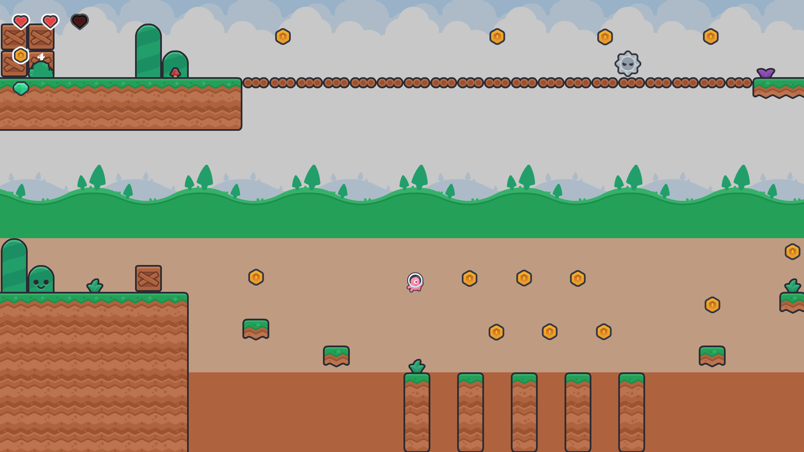

<h1>Description</h1>

Pinky Jump is a small 2D side-scrolling platform game in which you control a
little pink character, with whom you must reach the goal located in the castle at the end of
the level by jumping across different platforms, facing enemies and collecting as many
coins as you can.

<h1>Controls</h1>

AD -> Left and Right directions.

Space Bar -> Jump.

<h1>Main technical challenges</h1>

Main technical challenges within the game: correct collision with the environment, making the game fluid, gravity control, and element spawning. 

Outside of the game: working with SFML and TMX for the first time and trying to have a well-structured project.

<h1>Visual of the game</h1>

